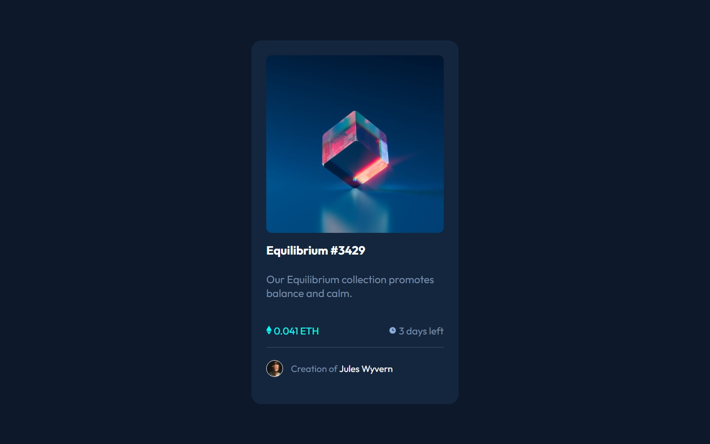
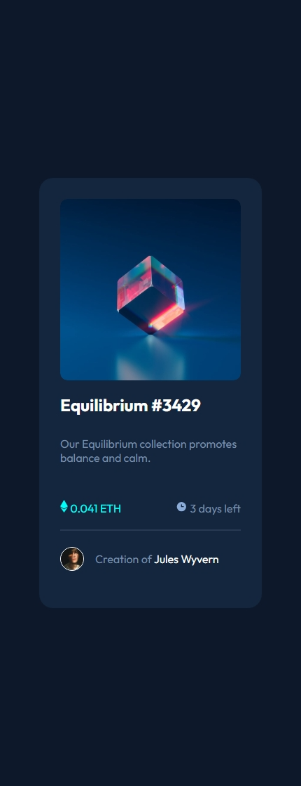

# Frontend Mentor - NFT preview card component solution

This is a solution to the [NFT preview card component challenge on Frontend Mentor](https://www.frontendmentor.io/challenges/nft-preview-card-component-SbdUL_w0U). Frontend Mentor challenges help you improve your coding skills by building realistic projects. 

## Table of contents

- [Overview](#overview)
  - [Screenshot](#screenshot)
  - [Links](#links)
- [My process](#my-process)
  - [Built with](#built-with)
  - [What I learned](#what-i-learned)
- [Author](#author)

## Overview

### Screenshot

Desktop View

Mobile View

### Links

- Solution URL: [Add solution URL here](https://your-solution-url.com)
- Live Site URL: [Add live site URL here](https://your-live-site-url.com)

## My process

### Built with

- Semantic HTML5 markup
- CSS custom properties
- Flexbox
- CSS Grid

### What I learned

During this project, I learned how to implement interactive hover effects, such as blurring an image and displaying an overlay icon or text. Additionally, I enhanced my skills in using CSS Grid and Flexbox for responsive layout design.

## Author

- Frontend Mentor - [@abdullah09c](https://www.frontendmentor.io/profile/abdullah09c)
- GitHub - [@abdullah09c](https://www.github.com/abdullah09c)

